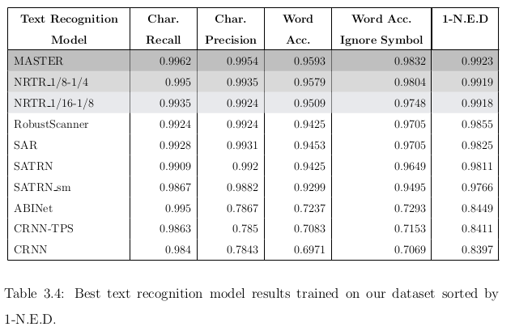

# A Comprehensive Gold Standard and Benchmark for Comics Text Detection and Recognition

The purpose of this work is to enable research on comics by improving the text quality of the largest comics dataset shared in [COMICS](https://arxiv.org/abs/1611.05118). During the process of generating high-quality text data, text detection and recognition models are trained and selected to create an end-to-end SOTA OCR pipeline for comics. The models are trained with custom-labeled data that we also share for text detection and recognition tasks.


## Description

This repository includes pointers to the code and data described in [Improving OCR Data for Comics Research: A Benchmark and Analysis](add-arxiv.link)

## Getting Started

- **'COMICS TEXT+' OCR data** can be accessed [here](https://drive.google.com/drive/folders/1Vq8RJQITh9NzjR0jpwvOP2cqbQoyq7qS?usp=sharing). The main version includes both raw text data and post-processed data with two columns, whereas the simplified version includes a single column of post-processed text. Check [Dependencies](#dependencies) to find out how you can get panels of textboxes.

- **'COMICS TEXT+' Text Detection Dataset** can be accessed [here](https://drive.google.com/drive/folders/1a--6MNhPSqEZN3bMhlooLJ1ZIcj5CCBg?usp=sharing). Check [Execution Information](#execution-information) to train your models with it.

- **'COMICS TEXT+' Text Recognition Dataset** can be accessed [here](https://drive.google.com/drive/folders/1BRQS6UJPzo9zaUAJiLDUr2xCAIc7-2rx?usp=sharing). Check [Execution Information](#execution-information) to train your models with it.

- **Finetuned text detection model, FCENet** can be accessed [here](https://drive.google.com/drive/folders/1fZTbT-VsWJ9KiuvVYzV5q5qggoeoYzxr?usp=sharing). This is fine-tuned with 'COMICS Text+: Text Detection' dataset and it is our most performant model.

- **Finetuned text recognition model, MASTER** can be accessed [here](https://drive.google.com/drive/folders/1zczO8XOpNBkepDreTPaqaj31pk_wHRCj?usp=sharing). This is fine-tuned with 'COMICS Text+: Text Recognition' dataset and it is our most performant model.

- **Ground Truth** Data for evaluation: texts of 500 random textboxes are prepared. GT is used for evaluation and comparison between COMICS and COMICS TEXT+. GT can be accessed [here](https://drive.google.com/drive/folders/1MjlXQF9GhNS3ZgSFqZw2j_X3uUjDpSKb?usp=sharing)

### Dependencies

- **[MMOCR](https://github.com/open-mmlab/mmocr)**: Version 0.6.0 is used for this work. You can check the original repository for instructions on how to set up the MMOCR toolkit. Models and evaluation kits of MMOCR are used for this work.
- **[labelme](https://github.com/wkentaro/labelme)** We modified 'labelme' to support annotation of text detection and text recognition by enabling it to get predictions from our detection and recognition models. This makes the annotation process faster since all you need to do is adjust the predictions to label. **The modified version of 'labelme' can be found [here](https://github.com/gsoykan/labelme)**
- **[The Amazing Mysteries of the Gutter: Drawing Inferences Between Panels in Comic Book Narratives.](https://github.com/miyyer/comics)** is the paper that COMICS dataset is shared. If you want to access the panel images then you should download 'extracted panel images' from [here](https://obj.umiacs.umd.edu/comics/index.html).

### Execution Information

- **Text detection training & testing:** Use the configs shared in ./text_det_configs and place them under their indicated locations. Do not forget to download the data.

```
#  in the appropriate environment with MMOCR toolkit run the below commands
# Training
python tools/train.py {config_path e.g. fcenet_r50dcnv2_fpn_1500e_ctw1500_custom} --load-from {pretrained_model_path}
# Testing
python tools/test.py {config_path} {fine_tuned_model_path} --eval hmean-iou
```

- **Text recognition training & testing:** Use the configs shared in ./text_recong_configs and place them under their indicated locations. Do not forget to download the data.

```
#  in the appropriate environment with MMOCR toolkit run the below commands
# Training
python tools/train.py {config_path e.g. master_custom_dataset} --load-from {pretrained_model_path}
# Testing
python tools/test.py {config_path} {fine_tuned_model_path} --eval --eval acc
```

- **Using end-to-end models:** text_extractor.py can be used to extract text from a speech bubble or narrative boxes.

```python
ocr_detector_config="./mmocr/work_dirs/fcenet_r50dcnv2_fpn_1500e_ctw1500_custom/fcenet_r50dcnv2_fpn_1500e_ctw1500_custom.py",
ocr_detector_checkpoint='./mmocr/work_dirs/fcenet_r50dcnv2_fpn_1500e_ctw1500_custom/best_0_hmean-iou:hmean_epoch_5.pth',
recog_config='./mmocr/work_dirs/master_custom_dataset/master_custom_dataset.py',
ocr_recognition_checkpoint='./mmocr/work_dirs/master_custom_dataset/best_0_1-N.E.D_epoch_4.pth',
det='FCE_CTW_DCNv2',
recog='MASTER'

text_extractor = TextExtractor(batch_mode=True,
                              det=det,
                              det_ckpt=ocr_detector_checkpoint,
                              det_config=ocr_detector_config,
                              recog=recog,
                              recog_ckpt=ocr_recognition_checkpoint,
                              recog_config=recog_config)
textbox_img_path = './imgs/sample_textbox.jpg'
ocr_text = text_extractor.extract_text(textbox_img_path)
print(ocr_text)
```

### Results





We replicated the model presented in [The Amazing Mysteries of the Gutter: Drawing Inferences Between Panels in Comic Book Narratives.](https://github.com/miyyer/comics) to see whether improvement on text quality would affect the results for Cloze Style Tasks. With **COMICS Text+**, we achieve SOTA results and can see improvement on our replcation results in almost all of the cases that relies heavily on text.


## Authors

Gürkan Soykan  
[twitter](https://twitter.com/grknsoykan)
[LinkedIn](https://www.linkedin.com/in/gurkan-soykan/)

## License

This project is licensed under the [NAME HERE] License - see the LICENSE.md file for details

## Acknowledgments

- [COMICS](https://github.com/miyyer/comics)
- [labelme](https://github.com/wkentaro/labelme)
- [MMOCR](https://github.com/open-mmlab/mmocr)
